<br>
<div style="font-style: bold; text-align: center;">
<br>Department of Computer Science & Engineering
<br><br><br>
</div>
<br><br>
<div style="font-style:underline; text-align: center;" markdown="1">

# Lab Report – 3
<br><br>
<br><br>

</div>


<div style="font-style: bold; text-align: left;" markdown="1">

## Semester : Spring 2022

## Course Number : CSE303

## Course Title : Statistics for Data Science

## Course Instructor : Md Al-Imran

<br><br>
<br><br>
<br><br>
<br><br>

## > student ID: 2019-1-60-093
## > Student Name: Md. Asad Chowdhury Dipu
## > Section: 03
## > Date Of Submission: 9/03/2022
<br>
</div>
<br>

## Pandas Series


```python
import pandas as pd
```


```python
obj = pd.Series([4,10,-5,15])
obj
```


    0     4
    1    10
    2    -5
    3    15
    dtype: int64


```python
obj +2
```


    0     6
    1    12
    2    -3
    3    17
    dtype: int64


```python
obj*2
```


    0     8
    1    20
    2   -10
    3    30
    dtype: int64


```python
obj%2
```


    0    0
    1    0
    2    1
    3    1
    dtype: int64


```python
obj[obj%2==0]
```


    0     4
    1    10
    dtype: int64


```python
sdata = {'Ohio': 35000, 'Texas': 71000, 'Oregon': 16000,
'Utah': 5000}
obj3 = pd.Series(sdata)
print(obj3)
```

    Ohio      35000
    Texas     71000
    Oregon    16000
    Utah       5000
    dtype: int64
    


```python
data = {"EWU":1212, "DU":1211, "KUET":7455, "KU":7456,"KUET":7454}
obj1=pd.Series(data)
obj1
```


    EWU     1212
    DU      1211
    KUET    7454
    KU      7456
    dtype: int64


## Pandas DataFrame


```python
#From List
list1 = [['Sujon',12,3.5,10],['Mehedi',20,15,13.5],['Kashem',11,13,7.688]]
df = pd.DataFrame(list1)
print(df.head())
```

            0   1     2       3
    0   Sujon  12   3.5  10.000
    1  Mehedi  20  15.0  13.500
    2  Kashem  11  13.0   7.688
    


```python
list1 = [['Alice',23,3.5,10],['Bob',24,3.4,6],['Charlie',22,3.9,8]]
df = pd.DataFrame(list1)
df.columns = ['name','age','cgpa','hoursStudied']
print(df.head())
```

          name  age  cgpa  hoursStudied
    0    Alice   23   3.5            10
    1      Bob   24   3.4             6
    2  Charlie   22   3.9             8
    


```python
#From Dictionary
dict1 = {'id':[1,2,3],'name':['alice','bob','charlie'],'age':[20, 25, 32]}
df1 = pd.DataFrame(dict1)
print(df1)
```

       id     name  age
    0   1    alice   20
    1   2      bob   25
    2   3  charlie   32
    


```python
#From CSV File
df2 = pd.read_csv('sample_data_1.csv', header = None)
df2.columns=['id','state','population','murder_rate']
print(df2)
df2.head() # displays first 5 rows
df2.tail() # displays last 5 rows
df2.count() # displays number of values for each column
```

       id        state  population  murder_rate
    0   1      Alabama     4779736          5.7
    1   2       Alaska      710231          5.6
    2   3      Arizona     6392017          4.7
    3   4     Arkansas     2915918          5.6
    4   5   California    37253956          4.4
    5   6     Colorado     5029196          2.8
    6   7  Connecticut     3574097          2.4
    7   8     Delaware      897934          5.8
    


    id             8
    state          8
    population     8
    murder_rate    8
    dtype: int64


```python
#Seleting the first cell
print(df1.iloc[0][0])
print(df1.loc[0]['name'])
```

    1
    alice
    


```python
#Selecting a few columns
df3=df[['name','cgpa']]
print(df3)
```

          name  cgpa
    0    Alice   3.5
    1      Bob   3.4
    2  Charlie   3.9
    


```python
#selecting a few rows
df4 = df1.loc[1:2]
print(df4)
df5 = df1.iloc[1:3]
print(df5)
```

       id     name  age
    1   2      bob   25
    2   3  charlie   32
       id     name  age
    1   2      bob   25
    2   3  charlie   32
    


```python
#selecting a few rows and columns
df4 = df1.loc[1:2,['name','age']]
print(df4)
df5 = df1.iloc[1:3,[0,1]]
print(df5)
```

          name  age
    1      bob   25
    2  charlie   32
       id     name
    1   2      bob
    2   3  charlie
    


```python
#appending two dataframes
list1 = [['Alice',23,3.5,10],['Bob',24,3.4,6],['Charlie',22,3.9,8]]
df = pd.DataFrame(list1)
df.columns = ['name','age','cgpa','hoursStudied']
list2 = [['Don',21,2.5,2],['Elton',25,2.75,4]]
df11 = pd.DataFrame(list2)
df11.columns = ['name','age','cgpa','hoursStudied']
df12 = df.append(df11, ignore_index=True)
print(df12)
```

          name  age  cgpa  hoursStudied
    0    Alice   23  3.50            10
    1      Bob   24  3.40             6
    2  Charlie   22  3.90             8
    3      Don   21  2.50             2
    4    Elton   25  2.75             4
    


```python
#deleting rows/columns from a dataframe
df12.drop([0,1], inplace=True)
df12.drop(['cgpa'], axis=1, inplace=True)
```


```python
#Renaming columns
new_cols = ['n','a','hs']
df12.columns=new_cols
print(df12)
```

             n   a  hs
    2  Charlie  22   8
    3      Don  21   2
    4    Elton  25   4
    

# Data Filtering, Sorting


```python
cgpa_greater_than_three_point_five1 = df[df['cgpa'] > 3.5]
cgpa_greater_than_three_point_five2 = df.loc[df['cgpa'] > 3.5]
cgpa_greater_than_three_point_five3 = df.query('cgpa > 3.5')
print(cgpa_greater_than_three_point_five1)
print(cgpa_greater_than_three_point_five2)
print(cgpa_greater_than_three_point_five3)
df1.sort_values(by='age',ascending=False)
```

          name  age  cgpa  hoursStudied
    2  Charlie   22   3.9             8
          name  age  cgpa  hoursStudied
    2  Charlie   22   3.9             8
          name  age  cgpa  hoursStudied
    2  Charlie   22   3.9             8
    


<div>
<style scoped>
    .dataframe tbody tr th:only-of-type {
        vertical-align: middle;
    }

    .dataframe tbody tr th {
        vertical-align: top;
    }

    .dataframe thead th {
        text-align: right;
    }
</style>
<table border="1" class="dataframe">
  <thead>
    <tr style="text-align: right;">
      <th></th>
      <th>id</th>
      <th>name</th>
      <th>age</th>
    </tr>
  </thead>
  <tbody>
    <tr>
      <th>2</th>
      <td>3</td>
      <td>charlie</td>
      <td>32</td>
    </tr>
    <tr>
      <th>1</th>
      <td>2</td>
      <td>bob</td>
      <td>25</td>
    </tr>
    <tr>
      <th>0</th>
      <td>1</td>
      <td>alice</td>
      <td>20</td>
    </tr>
  </tbody>
</table>
</div>


```python
print(df2)
```

       id        state  population  murder_rate
    0   1      Alabama     4779736          5.7
    1   2       Alaska      710231          5.6
    2   3      Arizona     6392017          4.7
    3   4     Arkansas     2915918          5.6
    4   5   California    37253956          4.4
    5   6     Colorado     5029196          2.8
    6   7  Connecticut     3574097          2.4
    7   8     Delaware      897934          5.8
    

# Computing Descriptive Statistical Measures


```python
murder_rate = df2[['murder_rate']]
print("Mean: " ,murder_rate.mean())
print("Standard Deviation: ",murder_rate.std())
print("Variance: ",murder_rate.var())
print("Lower Quartile: " ,murder_rate.quantile(0.25))
print("Median: ",murder_rate.quantile(0.5))
print("Median: " ,murder_rate.median())
print("Upper Quartile: " ,murder_rate.quantile(0.75))
print("Skewness: " ,murder_rate.skew())
print("Kurtosis: " ,murder_rate.kurt())
print("Min: ",murder_rate.min())
print("Max: ",murder_rate.max())
```

    Mean:  murder_rate    4.625
    dtype: float64
    Standard Deviation:  murder_rate    1.350926
    dtype: float64
    Variance:  murder_rate    1.825
    dtype: float64
    Lower Quartile:  murder_rate    4.0
    Name: 0.25, dtype: float64
    Median:  murder_rate    5.15
    Name: 0.5, dtype: float64
    Median:  murder_rate    5.15
    dtype: float64
    Upper Quartile:  murder_rate    5.625
    Name: 0.75, dtype: float64
    Skewness:  murder_rate   -0.956943
    dtype: float64
    Kurtosis:  murder_rate   -0.715116
    dtype: float64
    Min:  murder_rate    2.4
    dtype: float64
    Max:  murder_rate    5.8
    dtype: float64
    

# Visualization


```python
df2['murder_rate'].value_counts().plot(kind = 'pie')
```


    <AxesSubplot:ylabel='murder_rate'>


    
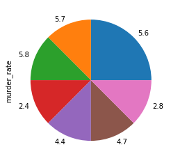
    


```python
df2.hist(column=['murder_rate'], bins = 5)
```


    array([[<AxesSubplot:title={'center':'murder_rate'}>]], dtype=object)


    
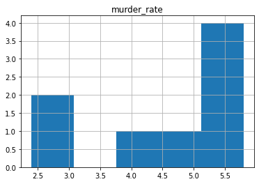
    


```python
df2['murder_rate'].value_counts().plot(kind = 'bar')
```


    <AxesSubplot:>


    
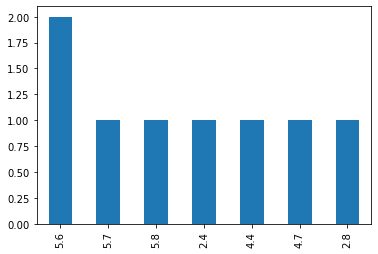
    


```python
df2.plot.scatter(x='state',y='murder_rate')
```


    <AxesSubplot:xlabel='state', ylabel='murder_rate'>


    
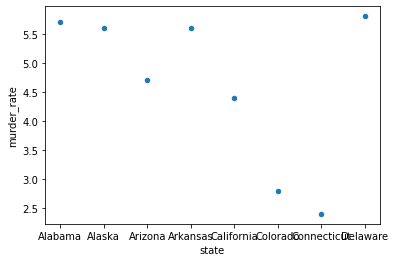
    


```python
df2.boxplot(column=['population','murder_rate'])
```


    <AxesSubplot:>


    
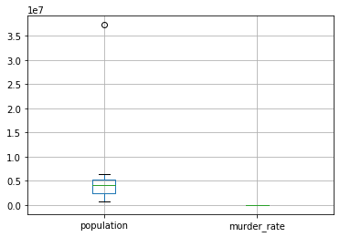
    


# Weather 


```python
df = pd.read_csv('weather.csv')
print(type(df))
print(df)
```

    <class 'pandas.core.frame.DataFrame'>
         outlook   temperature   humidity   windy  play
    0      sunny            85         85   False    no
    1      sunny            80         90    True    no
    2   overcast            83         86   False   yes
    3      rainy            70         96   False   yes
    4      rainy            68         80   False   yes
    5      rainy            65         70    True    no
    6   overcast            64         65    True   yes
    7      sunny            72         95   False    no
    8      sunny            69         70   False   yes
    9      rainy            75         80   False   yes
    10     sunny            75         70    True   yes
    11  overcast            72         90    True   yes
    12  overcast            81         75   False   yes
    13     rainy            71         91    True    no
    14     rainy           100         70    True    no
    15     sunny            45         70    True    no
    


```python
# first 5 records
print(df.head())
```

        outlook   temperature   humidity   windy  play
    0     sunny            85         85   False    no
    1     sunny            80         90    True    no
    2  overcast            83         86   False   yes
    3     rainy            70         96   False   yes
    4     rainy            68         80   False   yes
    


```python
# last 5 records
print(df.tail())
```

         outlook   temperature   humidity   windy  play
    11  overcast            72         90    True   yes
    12  overcast            81         75   False   yes
    13     rainy            71         91    True    no
    14     rainy           100         70    True    no
    15     sunny            45         70    True    no
    


```python
# description of the dataset
print(df.describe())
```

            temperature   humidity
    count     16.000000   16.00000
    mean      73.437500   80.18750
    std       11.764176   10.36802
    min       45.000000   65.00000
    25%       68.750000   70.00000
    50%       72.000000   80.00000
    75%       80.250000   90.00000
    max      100.000000   96.00000
    


```python
df.columns = ['outlook','temperature','humidity','windy','play']
```


```python
# Series
t = df['temperature']
print(type(t))
print(t)
```

    <class 'pandas.core.series.Series'>
    0      85
    1      80
    2      83
    3      70
    4      68
    5      65
    6      64
    7      72
    8      69
    9      75
    10     75
    11     72
    12     81
    13     71
    14    100
    15     45
    Name: temperature, dtype: int64
    


```python
sum = 0
for value in t:
    sum+=value
print(sum)
```

    1175
    


```python
df1 = df[['temperature','humidity']]
print(df1)
```

        temperature  humidity
    0            85        85
    1            80        90
    2            83        86
    3            70        96
    4            68        80
    5            65        70
    6            64        65
    7            72        95
    8            69        70
    9            75        80
    10           75        70
    11           72        90
    12           81        75
    13           71        91
    14          100        70
    15           45        70
    


```python
df2 = df.loc[0:9,['temperature','humidity']]
print(df2)
```

       temperature  humidity
    0           85        85
    1           80        90
    2           83        86
    3           70        96
    4           68        80
    5           65        70
    6           64        65
    7           72        95
    8           69        70
    9           75        80
    


```python
df3 = df.iloc[0:10,[1,2]]
print(df3)
```

       temperature  humidity
    0           85        85
    1           80        90
    2           83        86
    3           70        96
    4           68        80
    5           65        70
    6           64        65
    7           72        95
    8           69        70
    9           75        80
    


```python
df4 = df.iloc[1::2,[0,1,3]]
print(df4)
```

         outlook  temperature  windy
    1      sunny           80   True
    3      rainy           70  False
    5      rainy           65   True
    7      sunny           72  False
    9      rainy           75  False
    11  overcast           72   True
    13     rainy           71   True
    15     sunny           45   True
    


```python
temperature = df[['temperature']]
print("Mean: " , temperature.mean())
print("Standard Deviation: ", temperature.std())
print("Variance: ", temperature.var())
print("Lower Quartile: " , temperature.quantile(0.25))
print("Median: ", temperature.quantile(0.5))
print("Median: " , temperature.median())
print("Upper Quartile: " , temperature.quantile(0.75))
print("Skewness: " , temperature.skew())
print("Kurtosis: " , temperature.kurt())
print("Min: ", temperature.min())
print("Max: ", temperature.max())
```

    Mean:  temperature    73.4375
    dtype: float64
    Standard Deviation:  temperature    11.764176
    dtype: float64
    Variance:  temperature    138.395833
    dtype: float64
    Lower Quartile:  temperature    68.75
    Name: 0.25, dtype: float64
    Median:  temperature    72.0
    Name: 0.5, dtype: float64
    Median:  temperature    72.0
    dtype: float64
    Upper Quartile:  temperature    80.25
    Name: 0.75, dtype: float64
    Skewness:  temperature   -0.13398
    dtype: float64
    Kurtosis:  temperature    2.521107
    dtype: float64
    Min:  temperature    45
    dtype: int64
    Max:  temperature    100
    dtype: int64
    


```python
df.hist(column=['temperature'], bins = 5)
```


    array([[<AxesSubplot:title={'center':'temperature'}>]], dtype=object)


    
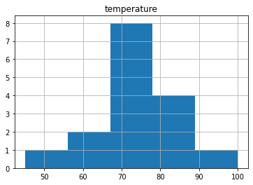
    


```python
df.hist(column='humidity', bins = 5)
```


    array([[<AxesSubplot:title={'center':'humidity'}>]], dtype=object)


    
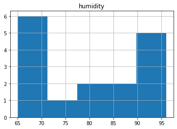
    


```python
humidity = df[['humidity']]
print("Mean: " , humidity.mean())
print("Standard Deviation: ", humidity.std())
print("Variance: ", humidity.var())
print("Lower Quartile: " , humidity.quantile(0.25))
print("Median: ", humidity.quantile(0.5))
print("Median: " , humidity.median())
print("Upper Quartile: " , humidity.quantile(0.75))
print("Skewness: " , humidity.skew())
print("Kurtosis: " , humidity.kurt())
print("Min: ", humidity.min())
print("Max: ", humidity.max())
```

    Mean:  humidity    80.1875
    dtype: float64
    Standard Deviation:  humidity    10.36802
    dtype: float64
    Variance:  humidity    107.495833
    dtype: float64
    Lower Quartile:  humidity    70.0
    Name: 0.25, dtype: float64
    Median:  humidity    80.0
    Name: 0.5, dtype: float64
    Median:  humidity    80.0
    dtype: float64
    Upper Quartile:  humidity    90.0
    Name: 0.75, dtype: float64
    Skewness:  humidity    0.118669
    dtype: float64
    Kurtosis:  humidity   -1.533119
    dtype: float64
    Min:  humidity    65
    dtype: int64
    Max:  humidity    96
    dtype: int64
    


```python
list1 = [[1,0], [1,1], [2,2], [2,3], [2,3], 
         [2,4], [3,4], [3,5], [4,6], [5,7]]
print(list1)
```

    [[1, 0], [1, 1], [2, 2], [2, 3], [2, 3], [2, 4], [3, 4], [3, 5], [4, 6], [5, 7]]
    


```python
df_list1 = pd.DataFrame(list1, columns = ['x','y'])
print(df_list1)
```

       x  y
    0  1  0
    1  1  1
    2  2  2
    3  2  3
    4  2  3
    5  2  4
    6  3  4
    7  3  5
    8  4  6
    9  5  7
    


```python
df_list1.hist(column = ['x'], bins = 5)
```


    array([[<AxesSubplot:title={'center':'x'}>]], dtype=object)


    
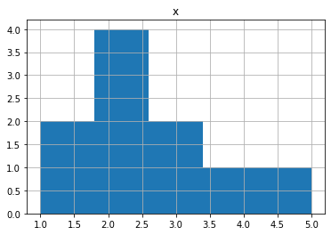
    


```python
print('Skew: ', df_list1[['x']].skew())
```

    Skew:  x    0.815005
    dtype: float64
    


```python
df_list1.hist(column = ['y'], bins = 8)
```


    array([[<AxesSubplot:title={'center':'y'}>]], dtype=object)


    
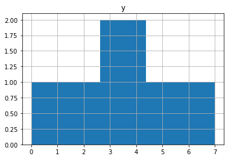
    


```python
print('Skew: ', df_list1[['y']].skew())
```

    Skew:  y    0.0
    dtype: float64
    


```python
print('Kurt - X: ', df_list1[['x']].kurt())
print('Kurt - Y: ', df_list1[['y']].kurt())
```

    Kurt - X:  x    0.25378
    dtype: float64
    Kurt - Y:  y   -0.53564
    dtype: float64
    


```python
df_list1.plot.scatter(x = "x", y = "y")
```


    <AxesSubplot:xlabel='x', ylabel='y'>


    
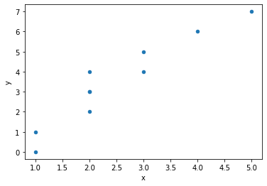
    


```python
df_list1.boxplot(column = ['x', 'y'])
```


    <AxesSubplot:>


    
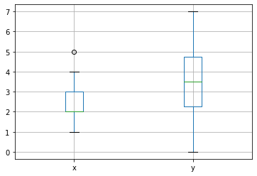
    


```python

```
