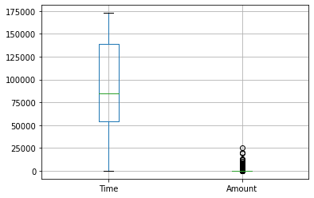
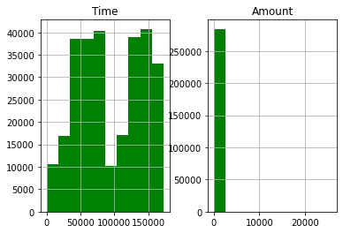
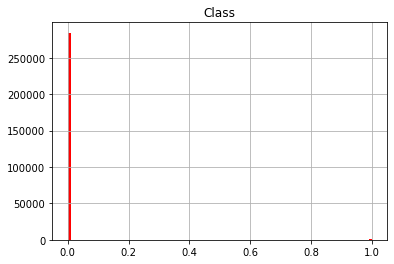
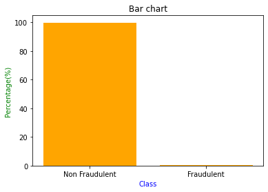
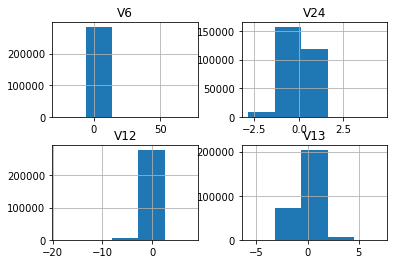
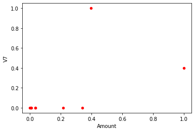
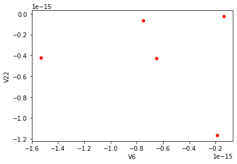
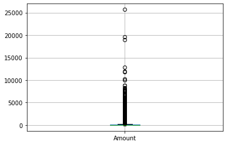
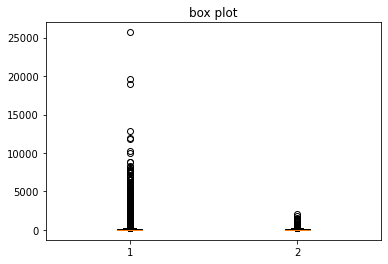

<br>
<div style="font-style: bold; text-align: center;">
<br>Department of Computer Science & Engineering
<br><br><br>
</div>
<br><br>
<div style="font-style:underline; text-align: center;" markdown="1">

# Lab Assignment – 1 (Tasks on Lab 04)
<br><br>
<br><br>

</div>


<div style="font-style: bold; text-align: left;" markdown="1">

## Semester : Spring 2022

## Course Number : CSE303

## Course Title : Statistics for Data Science

## Course Instructor : Md Al-Imran

<br><br>
<br><br>
<br><br>
<br><br>

## > student ID: 2019-1-60-093
## > Student Name: Md. Asad Chowdhury Dipu
## > Section: 03
## > Date Of Submission: 28/03/2022
<br>
</div>
<br>


```python
import pandas as pd
import matplotlib.pyplot as plt
```


```python
df = pd.read_csv('dataset_lab04.csv')
df.info()
```

    <class 'pandas.core.frame.DataFrame'>
    RangeIndex: 284807 entries, 0 to 284806
    Data columns (total 31 columns):
     #   Column  Non-Null Count   Dtype  
    ---  ------  --------------   -----  
     0   Time    284807 non-null  float64
     1   V1      284807 non-null  float64
     2   V2      284807 non-null  float64
     3   V3      284807 non-null  float64
     4   V4      284807 non-null  float64
     5   V5      284807 non-null  float64
     6   V6      284807 non-null  float64
     7   V7      284807 non-null  float64
     8   V8      284807 non-null  float64
     9   V9      284807 non-null  float64
     10  V10     284807 non-null  float64
     11  V11     284807 non-null  float64
     12  V12     284807 non-null  float64
     13  V13     284807 non-null  float64
     14  V14     284807 non-null  float64
     15  V15     284807 non-null  float64
     16  V16     284807 non-null  float64
     17  V17     284807 non-null  float64
     18  V18     284807 non-null  float64
     19  V19     284807 non-null  float64
     20  V20     284807 non-null  float64
     21  V21     284807 non-null  float64
     22  V22     284807 non-null  float64
     23  V23     284807 non-null  float64
     24  V24     284807 non-null  float64
     25  V25     284807 non-null  float64
     26  V26     284807 non-null  float64
     27  V27     284807 non-null  float64
     28  V28     284807 non-null  float64
     29  Amount  284807 non-null  float64
     30  Class   284807 non-null  int64  
    dtypes: float64(30), int64(1)
    memory usage: 67.4 MB
    

# 1. How many rows and columns this dataframe has? Print this information.


```python
def lab04_task1_2019_1_60_093():
    print ('Number of rows: ', df.shape[0])
    print ('Number of columns: ', df.shape[1])
lab04_task1_2019_1_60_093()
```

    Number of rows:  284807
    Number of columns:  31
    

# 2. Describe (numerical summary) the time and amount column. Print this information. 


```python
def lab04_task2_2019_1_60_093():
    print(df[['Time', 'Amount']].describe())
lab04_task2_2019_1_60_093()
```

                    Time         Amount
    count  284807.000000  284807.000000
    mean    94813.859575      88.349619
    std     47488.145955     250.120109
    min         0.000000       0.000000
    25%     54201.500000       5.600000
    50%     84692.000000      22.000000
    75%    139320.500000      77.165000
    max    172792.000000   25691.160000
    

# 3. There are 31 columns in the dataset. Compute some statistical measures like mean, median, standard deviation, variance using Pandas Function for at least two columns. Print this information.


```python
def lab04_task3_2019_1_60_093():
    Amount = df['Amount']
    print("\nMeasures of Amount\n")
    print("Mean: " ,Amount.mean())
    print("Median: " ,Amount.median())
    print("Standard Deviation: ",Amount.std())
    print("Variance: ",Amount.var())
    print("Min: ",Amount.min())
    print("Max: ",Amount.max())
    print("Lower Quartile: " ,Amount.quantile(0.25))   
    print("Upper Quartile: " ,Amount.quantile(0.75))
    print("Skewness: " ,Amount.skew())

    Time = df['Time']
    
    print("\nMeasures of Time\n")
    print("Mean: " ,Time.mean())
    print("Median: " ,Time.median())
    print("Standard Deviation: ",Time.std())
    print("Variance: ",Time.var())
    print("Min: ",Time.min())
    print("Max: ",Time.max())
    print("Lower Quartile: " ,Time.quantile(0.25))    
    print("Upper Quartile: " ,Time.quantile(0.75))
    print("Skewness: " ,Time.skew())


lab04_task3_2019_1_60_093()
 
```

    
    Measures of Amount
    
    Mean:  88.34961925087359
    Median:  22.0
    Standard Deviation:  250.1201092402221
    Variance:  62560.069046340635
    Min:  0.0
    Max:  25691.16
    Lower Quartile:  5.6
    Upper Quartile:  77.16499999999999
    Skewness:  16.977724453761024
    
    Measures of Time
    
    Mean:  94813.85957508067
    Median:  84692.0
    Standard Deviation:  47488.14595456582
    Variance:  2255124006.202146
    Min:  0.0
    Max:  172792.0
    Lower Quartile:  54201.5
    Upper Quartile:  139320.5
    Skewness:  -0.0355676180063216
    

# 4. Show the Box Plot of Time and Amount column. Also print the value of Q1, Median, Q3, IQR. Are there any outliers? Explain your answer and print it. 


```python
def lab04_task4_2019_1_60_093(): 
    df.boxplot(column = ['Time','Amount'])

    Time = df['Time']   
    print("Time Min: ",Time.min()) 
    print("Time Lower Quartile Q1: " ,Time.quantile(0.25))
    print("Time Median: ",Time.median())
    print("Time Upper Quartile Q3: " ,Time.quantile(0.75))
    print("Time Interquartile renge(IQR) : ",Time.quantile(0.75) - Time.quantile(0.25))
    print("Time Max: ",Time.max())
    
    print("\n")

    Amount = df['Amount']
    print("Amount Min: ",Amount.min())
    print("Amount Lower Quartile Q1: " ,Amount.quantile(0.25))
    print("Amount Median: " ,Amount.median())
    print("Amount Upper Quartile Q3: " ,Amount.quantile(0.75))
    print("Amount Interquartile renge(IQR) : ",Amount.quantile(0.75) - Amount.quantile(0.25))
    print("Amount Max: ",Amount.max())

lab04_task4_2019_1_60_093()
```

    Time Min:  0.0
    Time Lower Quartile Q1:  54201.5
    Time Median:  84692.0
    Time Upper Quartile Q3:  139320.5
    Time Interquartile renge(IQR) :  85119.0
    Time Max:  172792.0
    
    
    Amount Min:  0.0
    Amount Lower Quartile Q1:  5.6
    Amount Median:  22.0
    Amount Upper Quartile Q3:  77.16499999999999
    Amount Interquartile renge(IQR) :  71.565
    Amount Max:  25691.16
    


    

    


###  from the boxplot i can see there is no outlier in 'Time' colum. There is no value out size the whiskers. But in 'Amount' there is outlier because there is a lot of value out size the upper whisker.

# 5. Show the Histogram of Time and Amount column. Print the value of the Skewness and Kurtosis using appropriate Pandas functions. Comment on the type of the data distribution and print it.


```python
def lab04_task5_2019_1_60_093():
    df.hist(column = ["Time", "Amount"], bins = 10, color='green')

    Time = df['Time']
    print("Time\n")
    print("Skewness of time: " , Time.skew()) #it is 
    print("Kurtosis of time: " , Time.kurt()) #it is Platykurtosis
    
    print("\n")
    
    Amount = df['Amount']
    print("Amount\n")
    print("Skewness of amount: " , Amount.skew())  #it is positive or right skewed
    print("Kurtosis of amount: " , Amount.kurt()) #it is Leptokurtosis
    
lab04_task5_2019_1_60_093()
```

    Time
    
    Skewness of time:  -0.0355676180063216
    Kurtosis of time:  -1.2935300508989838
    
    
    Amount
    
    Skewness of amount:  16.977724453761024
    Kurtosis of amount:  845.0926455465277
    


    

    


#### Here time shows negative or left-skewed and Leptokurtosis. On the other hand Amount shows positive or right skewed and Leptokurtosis.

# 6. Find the percentage of records with class value = 0 (Non-Fraudulent) and class value = 1 (Fraudulent). Print this information. 


```python
def lab04_task6_2019_1_60_093():
    Non_Fraudulent = len(df[df['Class']==0])
    Fraudulent = len(df[df['Class']==1])
    
    print('Number of Non_Fraudulent class value 0: ', Non_Fraudulent)
    print('Number of Fraudulent class value 1: ', Fraudulent)
    
    print("\n")

    print("Class value 0 :", Non_Fraudulent/len(df['Class'])*100,"%")
    print("Class value 1 :",Fraudulent/len(df['Class'])*100,"%")

lab04_task6_2019_1_60_093()
```

    Number of Non_Fraudulent class value 0:  284315
    Number of Fraudulent class value 1:  492
    
    
    Class value 0 : 99.82725143693798 %
    Class value 1 : 0.1727485630620034 %
    

# 7. Show the result you have got in 6 using a Histogram.


```python
def lab04_task7_2019_1_60_093():
    df.hist(column = ['Class'],color='red', bins = 100)
lab04_task7_2019_1_60_093()
```


    

    


# 8. Show the result you have got in 6 using a Bar chart. Create the bar chart on the percentage value, not on the total number of occurrences. 


```python
def lab04_task8_2019_1_60_093():
    Non_Fraudulent = len(df[df['Class']==0])*100/len(df['Class'])
    Fraudulent = len(df[df['Class']==1])*100/len(df['Class'])
    
    x=[0,1]
    y=[ Non_Fraudulent,Fraudulent]
    tick = ['Non Fraudulent','Fraudulent']
    plt.bar(x,y, tick_label= tick, color='orange')
    plt.xlabel('Class', color='blue')
    plt.ylabel('Percentage(%)', color='green')
    plt.title("Bar chart", color='black')
    plt.show()
    
lab04_task8_2019_1_60_093()
```


    

    


# 9. Show the Histrogram (data distribution) of a few other columns (your choice) showing both positive and negative skew and also leptokurtic and platykurtic data distribution. So, you should display at least four Histograms. 


```python
def lab04_task9_2019_1_60_093():
    df.hist(column = ["V6","V24", "V12", "V13"], bins = 5)
    
    print("Skewness of V6 :",df['V6'].skew()) # here it shows Negative or left-skewed
    print("Kurtosis of V24 :",df['V24'].kurt()) # platykurtic kurtosis
    
    print("\n")
    
    print("Kurtosis of V12 :",df['V12'].kurt()) # Leptokurtic kurtosis
    print("Skewness of V28 :",df['V28'].skew()) #here it shows positive or right skewed
    

lab04_task9_2019_1_60_093()
```

    Skewness of V6 : 1.826580664998085
    Kurtosis of V24 : 0.6188707999933452
    
    
    Kurtosis of V12 : 20.241869662225426
    Skewness of V28 : 11.19209119221281
    


    

    


# 10. Find the highest positive correlation among all attributes. While finding the correlation, use appropriate code, not manually. Print this information accordingly.


```python
def lab04_task10_2019_1_60_093():
    corr = df.corr()
    positive_corr= corr[corr > 0]
    unst=positive_corr.unstack()
    sort= unst.sort_values(kind="quicksort", ascending=False)
    print('Highest correlation: ',sort[32:33])

lab04_task10_2019_1_60_093()
```

    Highest correlation:  Amount  V7    0.397311
    dtype: float64
    

# 11. Support your findings in Question 10 using a Scatter Plot.


```python
def lab04_task11_2019_1_60_093():
    corr = df.corr()
    positive_corr= corr[corr > 0]
    positive_corr.plot.scatter(x='Amount',y='V7', c='red')
    print("scatter plot between Amount and V7:")

lab04_task11_2019_1_60_093()
```

    scatter plot between Amount and V7:
    


    

    


#### We found maxumum correlation value from Amount and v7 which is 0.397311.

# 12. Find the highest negative correlation among all attributes. While finding the correlation, use appropriate code, not manually. Print this information accordingly.


```python
def lab04_task12_2019_1_60_093():
    corr= df.corr()
    neg_corr= corr[corr < 0]
    unst=neg_corr.unstack()
    sort= unst.sort_values(kind="quicksort", ascending=False)
    print('Highest negative correlation: ')
    print(sort[0:1])

lab04_task12_2019_1_60_093()
```

    Highest negative correlation: 
    V22  V6   -4.705235e-19
    dtype: float64
    

# 13. Support your findings in Question 12 using a Scatter Plot.


```python
def lab04_task13_2019_1_60_093():
    print('Minimum correlation value between V22 and V6:')
    corr= df.corr()
    neg_corr= corr[corr < 0]
    neg_corr.plot.scatter(x ='V6', y= 'V22', c='red')

lab04_task13_2019_1_60_093()
```

    Minimum correlation value between V22 and V6:
    


    

    


# 14. Create a Box Plot of the Amount Column. 


```python
def lab04_task14_2019_1_60_093():
     df.boxplot(column = ['Amount'])
        
lab04_task14_2019_1_60_093()
```


    

    


# 15. Now create two other box plots side by side. The first one will show the Amount column value for which the class value = 0 (Non-Fraudulent) and the second one will show the Amount column value for which the class value = 1 (Fraudulent). Do you find any particular pattern by just considering Amount column. Explain your answer and print it accordingly.


```python
def lab04_task15_2019_1_60_093():
    Non_Fraudulent =df[['Amount', 'Class']].query('Class == 0')
    a_Class0 = Non_Fraudulent['Amount']
    
    Fraudulent =df[['Amount', 'Class']].query('Class == 1')
    a_Class1 = Fraudulent['Amount']
    
    columns = [a_Class0, a_Class1]
    fig,ax = plt.subplots()
    ax.boxplot(columns)
    plt.title("box plot")
    plt.show()
    
lab04_task15_2019_1_60_093()  
```


    

    


#### Comment: we can say that the column "Amount" has nearly no row where class is 0 (Non-Fraudulent) on the other hand CLass 1 (Fraudulent) has maximum row for column "Amount". So we can see a  Negative Correlation
